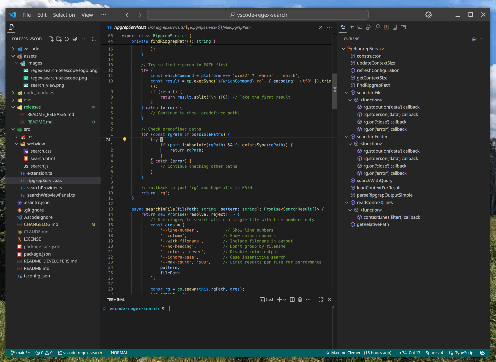

# VSCode Regex Search Telescope Extension

  

A fast and intuitive regex search extension for Visual Studio Code, inspired by vim telescope. 
Provides powerful text search capabilities with a clean split-pane (vertical) interface.

## Preview

## Functions

### 🔍 Search Current File
**Keybinding**: `Ctrl+Alt+F` (Windows/Linux) / `Cmd+Alt+F` (macOS)

Search within the currently active file with real-time regex matching and highlighting.

### 🔍 Search Workspace
**Keybinding**: `Ctrl+Alt+G` (Windows/Linux) / `Cmd+Alt+G` (macOS)

Search across all files in your workspace with blazing-fast performance powered by ripgrep.

## Configuration

### Context Size
You can customize how many lines of context are shown around each search result:

1. Open VS Code settings (`Ctrl+,` or `Cmd+,`)
2. Search for `regexSearch.contextSize`
3. Set the number of lines to show before and after each match (0-20, default: 3)

This setting controls both the content displayed in the context panel and its height, adapting automatically to show more or less context as needed.

## Requirements

- **VSCode**: Version 1.74.0 or higher
- **ripgrep**: Must be installed and available in system PATH

### Installing ripgrep

This extension depends on `ripgrep` for fast text searching. Please install it for your platform:

#### Windows
- **Using Chocolatey**: `choco install ripgrep`

#### macOS
- **Using Homebrew**: `brew install ripgrep`

#### Linux
- **Ubuntu/Debian**: `sudo apt install ripgrep`
- **Fedora/RHEL**: `sudo yum install ripgrep`

## Customizing Keyboard Shortcuts

You can customize the keyboard shortcuts for this extension:

1. Open VS Code settings (`Ctrl+,` or `Cmd+,`)
2. Go to **Keyboard Shortcuts** (`Ctrl+K Ctrl+S` or `Cmd+K Cmd+S`)
3. Search for "Regex Search" to find the extension commands
4. Click the pencil icon next to any command to change its keybinding
5. Set your preferred key combination

**Available commands:**
- `Regex Search: Search in Current File` (default: `Ctrl+Alt+F` / `Cmd+Alt+F`)
- `Regex Search: Search in Current Folder` (default: `Ctrl+Alt+G` / `Cmd+Alt+G`)

---

For installation instructions, changelog, detailed usage, development setup, releases, and contribution guidelines, see [README_DEVELOPERS.md](README_DEVELOPERS.md).
