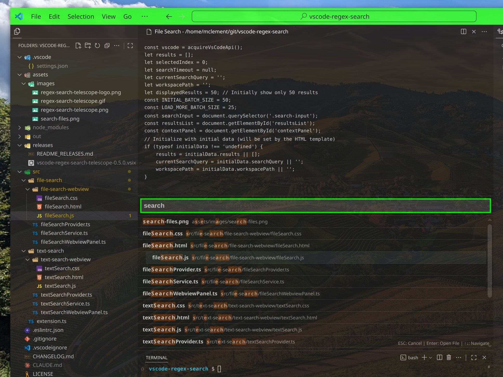

# QuickFind - VSCode Extension

  

A fast and intuitive search extension for Visual Studio Code, inspired by vim telescope. 
Provides powerful text search and file search capabilities with a clean split-pane interface.

QuickFind creates dedicated webview panels that provide a more user-friendly and immersive search experience with better context visualization, rather than using modal dialogs or terminal panels.

## Preview

## Functions

### 🔍 Search Current File
**Keybinding**: `Ctrl+K Ctrl+T` (Windows/Linux) / `Cmd+K Cmd+T` (macOS)

Search within the currently active file with real-time regex matching and highlighting. Features toggle buttons for case-sensitive and whole-word search options.

### 🔍 Search Workspace
**Keybinding**: `Ctrl+K Ctrl+G` (Windows/Linux) / `Cmd+K Cmd+G` (macOS)

Search across all files in your workspace with blazing-fast performance. Features toggle buttons for case-sensitive and whole-word search options.

### 📁 Search Files
**Keybinding**: `Ctrl+K Ctrl+F` (Windows/Linux) / `Cmd+K Cmd+F` (macOS)

Fuzzy search for files in your workspace. Find files by name with intelligent matching and see file metadata in the context panel.

## 🎛️ Search Options

QuickFind provides convenient toggle buttons for advanced search options in text search:

### Features:
- **Case-Sensitive Search**: Toggle the `Aa` button to enable/disable case-sensitive matching
- **Whole-Word Search**: Toggle the `W` button to match only complete words
- **Persistent Settings**: Your toggle preferences are automatically saved (in `/tmp/vscode-quickfind-config.json`) and remembered across sessions
- **Real-time Updates**: Changes apply immediately to your current search
- **Visual Feedback**: Inactive buttons appear muted, active buttons are highlighted with full color and green border

## ⏳ Search History

QuickFind automatically saves your search history for text searches, making it easy to reuse previous search queries.

### Features:
- **Automatic History**: Every search is automatically saved to your search history
- **Smart Defaults**: When opening text search, the most recent search is pre-filled and selected
- **Easy Navigation**: Use configurable keyboard shortcuts to browse through your search history
- **Persistent Storage**: Search history is saved to `/tmp/vscode-quickfind-text-search-history.json`
- **Limited Size**: History is automatically limited to 50 entries to keep it manageable

### History Navigation:
- **Previous Search**: `Ctrl+Up` (Windows/Linux) / `Cmd+Up` (macOS) - Navigate to older searches
- **Next Search**: `Ctrl+Down` (Windows/Linux) / `Cmd+Down` (macOS) - Navigate to newer searches or clear input

### History Management:
- **Clear History**: Use Command Palette (`Ctrl+Shift+P` / `Cmd+Shift+P`) and search for "QuickFind: Clear Search History" to remove all saved search history

## Configuration

### Context Size
**`quickFind.contextSize`** (number, default: 7)

Controls how many lines of context are shown around each search result. Set the number of lines to show before and after each match (0-20). This setting controls both the content displayed in the context panel and its height, adapting automatically to show more or less context as needed.

### Appearance

- **`quickFind.accentColor`** (string, default: "#00ff88"): Hex color code for search box border and selected result highlight (e.g., #ff5733 for orange, #0066cc for blue).

### Search Performance Options

- **`quickFind.maxFileSize`** (string, default: "1MB"): Maximum file size for search operations. Supports units like '500KB', '1MB', '2GB'.
- **`quickFind.maxResults`** (number, default: 1000): Maximum number of search results to display (1-10000).

## Requirements

- **VSCode**: Version 1.74.0 or higher

## Customizing Keyboard Shortcuts

You can customize the keyboard shortcuts for this extension:

1. Open VS Code settings (`Ctrl+,` or `Cmd+,`)
2. Go to **Keyboard Shortcuts** (`Ctrl+K Ctrl+S` or `Cmd+K Cmd+S`)
3. Search for "QuickFind" to find the extension commands
4. Click the pencil icon next to any command to change its keybinding
5. Set your preferred key combination

**Available commands:**
- `QuickFind: Search in Current File` (default: `Ctrl+K Ctrl+T` / `Cmd+K Cmd+T`)
- `QuickFind: Search in Current Folder` (default: `Ctrl+K Ctrl+G` / `Cmd+K Cmd+G`)
- `QuickFind: Search Files` (default: `Ctrl+K Ctrl+F` / `Cmd+K Cmd+F`)
- `QuickFind: Previous Search History` (default: `Ctrl+Up` / `Cmd+Up`)
- `QuickFind: Next Search History` (default: `Ctrl+Down` / `Cmd+Down`)
- `QuickFind: Clear Search History` (Command Palette only, no default keybinding)

---

For installation instructions, changelog, detailed usage, development setup, releases, and contribution guidelines, see [README_DEVELOPERS.md](README_DEVELOPERS.md).
